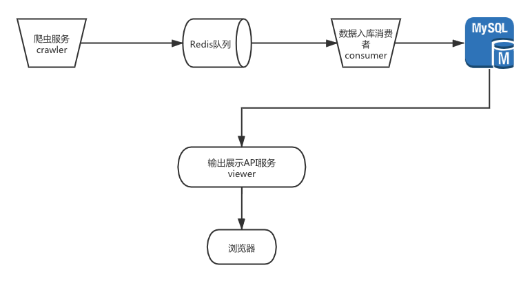
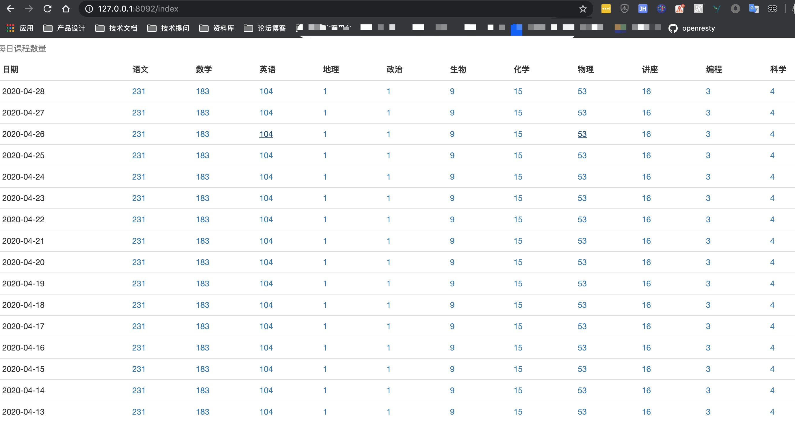
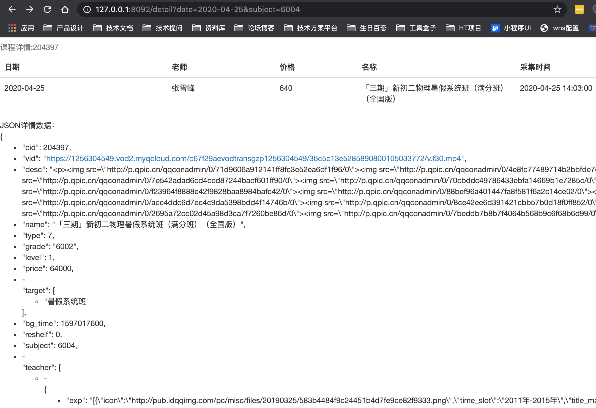

# 项目说明 
------
是一个简单的腾讯课堂爬虫
> * 功能介绍
> * 方案设计
> * 流程图
> * 架构说明

 
### 1. 功能介绍

- [x] 统计每天的各个学科课程数量。
- [x] 点击数量可以跳转页面查看每一门课的详情信息，包括课程id、课程标题、价格、老师等信息。
- [x] 简单的dashboard。
- [ ] 提供dashboard数据实时刷新（websocket）。


### 2. 方案设计



目录服务说明：
#####    1、crawler 爬虫服务，抓取数据 并把数据导入到Redis 队列，队列名称。
#####    2、fudao_consumer 数据消费者服务。从redis队列消费数据 写入到Redis。
#####    3、fudao_viewer 历史数据 前端数据API，提供查看功能。


#### a. 系统要求
    MySql 5.7+
    Redis


#### b. 数据解析
目前的辅导网站上的课程数据主要包括科目、年纪、课程类型（系统课，专题课）三个维度，

年级代码：
小班：8001
中班：8002
大班：8003
初一：6001
初二：6002
初三：6003
小学一年级到六年级：7001-7006
高一到高三： 5001-5003

课程类型代码：
6001：语文
6002：数学
6005：英语
6009：地理
6007：政治
6006：生物
6003：化学
6004：物理
6010：讲座
7057：编程【只有 3 4 5】
7058：科学

curl -H"referer: https://fudao.qq.com/subjec" "https://fudao.qq.com/cgi-proxy/course/discover_subject?client=4&platform=3&version=30&grade=6001&subject=6002&showid=0&page=1&size=10&t=0.4440"

通过修改grade，subject 批量得到课程数据。（暂时没考虑分页的情况）


#### c. 数据存储设计
sql文件记录在 database/database.sql

学科课程数量：（id为自增主键，date_time+subject+grade是唯一key）
| **字段名**   | **数据类型**   | **字段说明**   |
|:----|:----|:----|
| **id**  | bigint   | 主键ID   |
| **date_time**  | date   | 日期   |
| **subject**  | int   | 学科   | 
| **course_count**  | int   | 课数量   |
| **create_time**  | datetime   | 创建时间   |

学科详情：（id为自增主键，date_time+course_id）
| **字段名**   | **数据类型**   | **字段说明**   |
|:----|:----|:----|
| **id**  | bigint   | 主键ID   |
| **date_time**  | date   | 日期   |
| **course_id**  | int   | 课程id   |
| **subject**  | int   | 学科   |
| **grade**  | string   | 年级   |
| **title**  | string   | 课程名称   |
| **price**  | decailmal   | 价格   |
| **teacher**  | string   | 老师名称   |
| **detail**  | JSON   | 课程详情原生数据   |
| **create_time**  | datetime   | 创建时间   |


### 3. 服务启动配置说明
需要要 下述 `*.conf` 配置文件里面配置好Redis 和Mysql的信息。

启动 go module 管理
go env -w GO111MODULE=on
go env -w GOPROXY=https://goproxy.cn,direct

```shell
./crawler/crawler -c./crawler/crawler.conf

./fudao_viewer/fudao_viewer -c=./fudao_viewer/fudao_viewer.conf

./fudao_consumer/fudao_consumer -c=./fudao_consumer/fudao_consumer.conf
```


### 4. 最终效果
开始的时候没有数据：
在命令行主动调用一下 crawler 触发 主动采集
`curl "127.0.0.1:8089/gather?subject=19901010"`
如果要采集某个科目的就修改 subject 参数就好了

然后 启动 fudao_viewer 进程之后就可以看到数据了
http://127.0.0.1:8092/index


